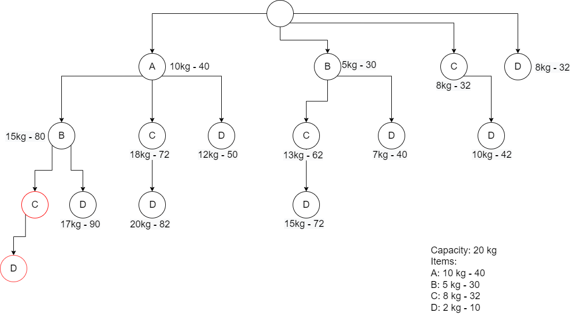

# Algorithms

An _algorithm_ is a finite sequence of well-defined instructions performed to accomplish a certain task. An algorithm can be used to define the steps of sorting an array, performing complex calculations, or even making your favorite recipe.

Often when we define a method in Java to perform a particular task for us, we are defining an algorithm.

## Optimizing Algorithms 

Many times when we try to solve a problem, we start with the simplest or most straightforward solution - a _brute force implementation_. Brute force implementations are generally not very elegant or efficient, but they get the task done. It's a good idea to start off with a brute force implementation, but many times we can refactor our solution to be more efficient.

Let's take a look at an example. Let's assume we have a sorted int array and we want to search for a particular integer in the array. We could define a brute force implementation where we check each element in the array for int 'x' in question.


```java
    public int search(int arr[], int x){
        for (int i = 0; i < arr.length; i++){
            if (arr[i] == x){
                return i;
            }
        }
        return -1;
    }
```

However, we can tackle this problem more efficiently. Because the array is sorted, we don't have to check each element. We can perform a binary search instead.


```java 
    public int search(int arr[], int x) {
        int l = 0, r = arr.length - 1;

        while (l <= r) {
            int m = l + (r - l) / 2;

            if (arr[m] == x)
                return m;

            if (arr[m] < x)
                l = m + 1;
            else
                r = m - 1;
        }
        return -1;
    }
```

## Measuring Algorithm Efficiency

Computers are able to do individual tasks quickly so when we measure algorithms, rather than focus on how many steps the algorithm has, we focus on how the number of steps change as the input scales. Think about our example above - the total number of steps that our algorithm has to take to search for a value depends on the size of the array.  As the array size increases, so does the number of operations we need to perform. For a linear search, we must perform one additional iteration for each element we add to the array.  For a binary search, we must perform one additional iteration when we double the array.  Based on this analysis, we can conclude that the binary search algorithm is more efficient.

In order to better analyze and optimize algorithms, we need a way to measure an algorithm's efficiency as the input scales. That way we can compare different implementations and their relative efficiencies and choose the best solution. 

We can use _asymptotic notation_ to measure these two search algorithm. Asymptotic notation includes Omega notation, Theta notation and Big-O notation. Each of these notations are ways for us to describe the running time of an algorithm as it approaches large input values.

Big-O is the most popular of the asymptotic notations. It's used to evaluate your code for worst case running time as your input size approaches an infinitely large number. Let's apply this idea to the linear and binary search above.


Image source: https://droidtechknow.com/programming/algorithms/big-o-notation/images/big-o-notation.jpg

Asymptotic notation is helpful for measuring both _time complexity_ and also _space complexity_. In our analysis above of a linear vs binary search, we compared their time complexity - the relative time needed to perform a certain operation. It is often important to evaluate space complexity as well - the relative amount of memory needed to perform certain operations.

Let's take a look at a couple sorting algorithms to see an example of this. 

### Bubble Sort 

[Wikipedia GIF on Bubble Sort](https://upload.wikimedia.org/wikipedia/commons/c/c8/Bubble-sort-example-300px.gif)

### Merge Sort

[Wikipedia GIF on Bubble Sort](https://upload.wikimedia.org/wikipedia/commons/c/cc/Merge-sort-example-300px.gif)

This [Big O Cheat Sheet](https://www.bigocheatsheet.com/) compares complexities and shows time and space complexity for common algorithms.

## Exercises

Find the time and space complexity for the following algorithms. Use Big-O notation.

1. Finding the max value in an array.

```java
    public int findMax(int[] arr){
        int max = arr[0];
        for(int i: arr){
            if(i>max){
                max = i;
            }
        }   
        return max;
    }
```

<details>
  <summary>Solution</summary>
  <p>O(n) - linear time</p>
</details>

1. Find the sum of two values.

```java
    public int findSum(int a, int b) {
        return a + b;
    }
```

<details>
  <summary>Solution</summary>
  <p>O(1) - constant time</p>
</details>


3. Find the sum and product of an array.
   
```java
    void printSumAndProduct(int[] array) {
        int sum = 0;
        int product = 1;
        for (int i = 0; i < array.length; I++) {
            sum += array[i];
        }
        for (int i = 0; i < array.length; i++) {
            product *= array[i];
        } 
        System.out.println(sum + ", " + product);
    }
```

<details>
  <summary>Solution</summary>
  <p>O(n) - linear time. Even though, we loop through the array twice, O(n) + O(n) is still represented as O(n)</p>
</details>

1. Print array values and constant set of numbers.
```java
    void printArrayValues(int[] arr) {
        for(int a : arr) {
            System.out.println(a);       
        }
        for (int i = 0; i < 1000000; i++) {
            System.out.println(i);       
        }
    }
```

<details>
  <summary>Solution</summary>
  <p>O(n) - linear time. The second iteration will be the same despite the size of the input. O(n) + O(1000000) is still represented as O(n)</p>
</details>

5. Print array values and constant set of numbers for each number.
```java
    void printArrayValues(int[] arr) {
        for(int a : arr) {
            System.out.println(a); 
            for (int i = 0; i < 1000000; i++) {
                System.out.println(i);       
            }      
        }
        
    }
```

<details>
  <summary>Solution</summary>
  <p>O(n) - linear time. It doesn't matter how many tasks we need to do per each n value, as long as it grows consistently for each value of n, the growth is linear.</p>
</details>


6. Print every possible pair of numbers in an array.
   
```java 
    void printPairs(int[] arr){
        for (int i = 0; i < arr.length; i++) {
            for (int j = 0; j < arr.length; j++) {
                System.out.println(arr[i] + ", " + arr[j]);
            }
        }
    }

```

<details>
  <summary>Solution</summary>
  <p>O(n^2) - quadratic time. Iterating over the array of size n once, and performing a unit of work for each iteration would be O(n). In this case, we are doing O(n) for every element in the array: O(n)*O(n) -> O(n^2)</p>
</details>

## Types of Algorithms

### Recursive Algorithms

Recursion is the process of breaking down a larger problem into smaller instances of the same problem. We are able to determine solutions to the smaller instances and use them to determine a larger solution.  Recursion in Java involves a method calling itself.  In order for the method to terminate, we need to define one or more base cases. 

For example, lets say we wanted to list all of the files in a file directory. As we list the files, we may come across a subdirectory. We now are faced with the same problem, and begin the process again. We continue this process until we have listed all of the files in the directory and all subdirectories.

We can see another example of recursion if we readdress the binary search algorithm we saw previously.

#### Iterative Binary Search

```java 
    public int search(int arr[], int x) {
        int l = 0, r = arr.length - 1;

        while (l <= r) {
            int m = l + (r - l) / 2;

            if (arr[m] == x)
                return m;

            if (arr[m] < x)
                l = m + 1;
            else
                r = m - 1;
        }
        return -1;
    }
```

#### Recursive Binary Search

```java
    int binarySearch(int arr[], int l, int r, int x){
        if (r >= l) {
            int mid = l + (r - l) / 2;
 
            if (arr[mid] == x){
                return mid;
            }
            if (arr[mid] > x){
                return binarySearch(arr, l, mid - 1, x);
            }
            return binarySearch(arr, mid + 1, r, x);
        }
        return -1;
    }
```

While recursion can provide an elegant strategy for solving an issue that may otherwise be complicated to solve iteratively, it is not always the best option. Both the iterative solution and the recursive solution above have a time complexity of O(n).  In terms of space complexity, however, the iterative solution is O(1) and the recursive solution is O(log n).  With recursion, each method call creates a new call stack where all of the variables of the method need be re-declared.  If we have n recursive method calls, we need n times the memory to complete the task. If we have log n recursive method calls, we need log n times the memory to complete the task.


#### Dynamic Programming
The iterative approach utilizes a concept called _dynamic programming_. Like recursion, dynamic programming breaks down a larger problem into simpler subproblems. Dynamic programming utilizes the fact that the overall solution depends on the solutions to the subproblems. But instead of recursively calling the method for each subproblem, we store the results of the subproblem for use in the larger problem. In the binary search example above, we initialize local variables `l` and `r` and update these values each time we iterate through the loop - each time we break down the problem further.

We can see this comparison in another example if we look at the fibonacci problem. Here, we're writing an algorithm, to determine the nth number of the fibonacci sequence.


Image source: Geeks for Geeks

#### Divide and Conquer Algorithms
Divide and Conquer algorithms are a subset of recursive algorithms that break down a problem into smaller subproblems and combine the results. In the above two examples, the recursive implementation of the fibonacci problem is a divide and conquer algorithm. It solves the subproblem of each previous number, combining them into the desired fibonacci number to give you the result. 

The recursive implementation of the binary search is not. While recursion is used to break down the problem, we're not using the result of each subproblem in the final result. We're just using the results of each subproblem to narrow down the search.

### Greedy Algorithms

A greedy algorithm is an algorithm that makes locally optimal choices at each stage in the hope of finding the globally optimal solution. In some cases, greedy algorithms find the globally optimal solution. However, it often does not guarantee it, as they often do not exhaust all of the possible solutions. 

--- 

A classic example of a greedy algorithm is the "fractional knapsack" problem. The idea behind the fractional knapsack is that we have a knapsack that we can fill up to a certain weight. We have different items that we can put in the knapsack. Each item has its own value. We want to fill the knapsack such that it holds the highest possible value.

Example:
- item 1: weight = 10 kg, value = 100
- item 2: weight = 60 kg, value = 300
- item 3: weight = 20 kg, value - 80
- knapsack capacity = 50 kg

The brute force solution is to try every combination of item fractions.

The greedy approach is to calculate the value per weight, and add the item with the highest value per kg, up to 50 kg.

- item 1: value = 10 per kg 
- item 2: value = 5 per kg
- item 3: value = 4 per kg 

Start with item 1 because it has the most value per kg. There are 10 kg available so we put 10 kg of item 1 in the knapsack. The knapsack has a capacity now of 40 kg. Item 2 has the next highest value per kg. There are 60 kg available of item 2, so the remaining capacity (40 kg) is filled with item 2. We use all of item 1 and 2/3 of item 2 to fill the backpack with the highest value possible.

---

Another example of a greedy algorithm is Dijkstra's algorithm. Dijkstra's algorithm is a well known algorithm for determining the shortest distance from one node to every other node in a graph.

The steps of Dijkstra's algorithm are as follows:
1. Begin with your starting node. 
   - Let the distance from the starting node, to the starting node be 0.
   - Let the distance from the starting node to every other node be infinity.
2. Visit the unvisited vertex with the smallest known distance from the start vertex.
3. For the current vertex examine its unvisited neighbors.
4. Calculate the distance of each neighbor from the start vertex.
5. If the calculated distance is less than the known distance, update the shortest distance.
6. Mark the current node as visited.
7. Repeat steps 2 + until all nodes are visited.

See an example of Dijkstra's algorithm [here](./dijkstras.md).

Dijkstra's algorithm is considered to be greedy because of step 2. We could choose any unvisited vertex, but we choose that which has the smallest known distance from the start. This is an example of choosing a locally optimal solution. In many cases, this choice pays off, but it is not always the most efficient.

### Branch & Bound Algorithms

Branch and Bound Algorithms are used to find an optimal solution for a particular problem. It uses a state space tree, which representing all the possible states (solution or nonsolution) of the problem from the root as an initial state to the leaf as a terminal state.

A branch and bound algorithm can be used to solve the 0/1 knapsack problem.



