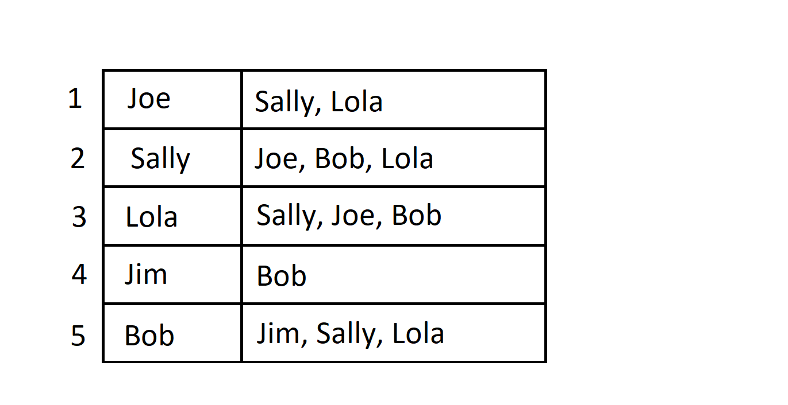

# Data Structures
Data structures provide a means for organizing and managing groups of data. There are many types of data structures. In Java, we are provided with the Collection API which contains many pre-implemented data structures for us to use. 

## Arrays
One of the most basic data structures available in Java is an array. An array is a fixed-length data structure that can hold any type of homogenous data. If a different size is needed, an array cannot be resized; a new array would need to be created of the desired size.

When initializing arrays, bracket notation is used along with the type the array contains. 

```java
    int[] arr1; // preferred
    int arr1[];
```

The size of the array is also needed when initialized.

```java
    int[] arr1 = new int[3]; 
    int[] arr2 = {23,57,2,-8}; 
```

### Array Indexing Strategies
Arrays have a 0-based index, meaning that the index starts at 1 and continue to length-1. Bracket notation is used to assign and access values in an array.

```java
    String[] arr = new String[4];
```


```java
    arr[0] = "Green";
```


```java
    arr[0] = "Blue";
```


```java
    arr[2] = "Yellow";
```


```java
    arr[5] = "Red";
    // this gives us an ArrayIndexOutOfBoundsException
```

Java also provides a helpful [utility class](https://docs.oracle.com/javase/8/docs/api/java/util/Arrays.html) for arrays, with static methods for operations such as sorting and searching.

### Multidimensional Arrays

Multidimensional Arrays are supported in Java, by creating arrays of arrays. Let's say, for example, we create an application to simulate the game play of tic tac toe. In order to do that, we need a representation of a 3x3 grid of characters. We can do this by creating three char arrays which we store in an array.

```java
    char[][] board = new char[3][3];
    /* 
        we can represent this visually as:
        [ [' ', ' ', ' '], [' ', ' ', ' '], [' ', ' ', ' '] ]

        or more intuitively as:
        [ 
            [' ', ' ', ' '], 
            [' ', ' ', ' '], 
            [' ', ' ', ' '] 
        ]
        
    */
```

We can assign and access elements of nested arrays, with bracket notation as well. In this case, the first index represents the top level array - which row we are referring to. The second index represents the nested array - which position in the row we are referring to.

```java
    board[0][0] = 'X';
    /* 
        [ 
            ['X', ' ', ' '], 
            [' ', ' ', ' '], 
            [' ', ' ', ' '] 
        ]     
    */
```

```java
    board[1][2] = 'O';
    /* 
        [ 
            ['X', ' ', ' '], 
            [' ', ' ', 'O'], 
            [' ', ' ', ' '] 
        ]     
    */
```

```java
    board[2][0] = 'X';
    /* 
        [ 
            ['X', ' ', ' '], 
            [' ', ' ', 'O'], 
            ['X', ' ', ' '] 
        ]     
    */
```

To iterate over a multidimensional, we would need to use a nested loop.

```java
    for(char[] row: board){
        for(char mark: row){
            System.out.print(mark+" ");
        }
        System.out.println();
    }
    
```

**Challenge:** write a method that determines if someone has won tic tac toe. It should take an input of a two dimensional char array and return the character of the winner, if the board is in a winning state.

For more on arrays, see Java's tutorial [here](https://docs.oracle.com/javase/tutorial/java/nutsandbolts/arrays.html).

## Array List
An array list is a linear, array backed data structure. It's a wrapper around an array with methods for managing the array data and the built in ability to resize. The ArrayList class in Java implements List interface's index based methods.

Because of the use of the array, methods like `get`, `set`, and `size` operate in constant time. The `add` method when used without an index operates in amortized constant time. _Amortized analysis_ refers to the average time it takes to complete an operation over the course of many operations. It allows us to compensate for operations that occasionally have much worse time complexity than their typical time complexity. This is the case with the `add` operation of the ArrayList. Most of the time, when we add an element to an ArrayList, the operation is O(1). However, when the ArrayList needs to be resized, the add operation requires that a new, larger array be created and for all of the existing elements to be added to the new array. Most other operations operate in O(n) time.

## Linked List
A linked list is a linear node based data structure. The linked list stores a reference to the head, or the first node of the linked list. The head contains the data of the first element, and also contains a reference to the next node. All of the nodes in the linked list are chained together, aware only of the following node - or in the case of a doubly linked list, the following and previous node. Java implements the LinkedList class as a doubly linked list. Linked lists are more efficient for insertion/deletion operations, while array lists are best used for read-only operations.


## Queues 
A queue is a data structure used for data processing, typically using the first in first out (FIFO) policy. In Java, the Queue interface contains the methods `add(E e)`, `remove()`, and `element()` to insert an element to the end of the queue, remove an element from the head of the queue, and to return but not remove the head of the queue, respectively. These three methods also have three equivalent methods `offer(E e)`, `poll()`, and `peek()`, which behave similarly but return a special value (e.g. null), when unexpected behavior occurs rather than throw an exception. 

A queue operates unidirectionally; one end of the queue will always be the head and one end of the queue will always be the tail. A deque, short for "double ended queue," supports insertion and removal at both ends. A common implementation of both the Queue and Deque interface is a LinkedList. If we need an array backed structure to operate as a Queue or Deque, Java has an ArrayDeque.

While the traditional processing order of a queue is FIFO, they don't always need to be. Java's `PriorityQueue` allows us to define a more specific processing order for our data, based on the implementation of the Comparable or Comparator interface. A PriorityQueue is based off of a priority heap, a type of tree-like data structure.


## Stacks
A stack is a data structure used for last in first out (LIFO) data processing. Browser history is a good application of a stack. When you navigate to a new web page, you expect that your browser keeps track of your navigation history. When you click on the back button, you want the browser to navigate to the last page.

While there is a `Stack` class in Java, it inherits from the `Vector` class, which has become obsolete in favor of other Collections. Any implementation of `Deque`, such as `ArrayDeque` or `LinkedList`, will provide you the needed functionality for LIFO data processing. 

Stacks are also relevant to us because part of Java's internal memory management uses a stack. When different method are invoked, a new stack frame is added to the top of the stack. This stack frame contains all of the local variables declared in that method. When the method completes, the stack frame pops off of the top of the stack and the previous stack frame becomes relevant. For more on this, see [java-memory-management.md](./java-memory-management.md).

## Trees

A tree is a non-linear, node based data structure. A tree has one root node. Non root nodes in a tree have exactly one parent node, creating a hierarchial structure. Each node can have 0 to many children nodes connected by "edges".

### Types of Trees

A _general tree_ is a tree that has no restrictions on the number of child nodes that a parent node can have. 


#### Binary Search Tree 
A _binary_ tree limits parents to 2 children. A _binary search tree_ is a binary tree that is organized such that (1) the left subtree of a node contains only children nodes with lesser values, (2) the right subtree of a node contains only children nodes with greater values, and (3) the left and right subtrees must only be a binary search tree. Binary search trees also cannot have duplicate values. 


Binary trees are not required to be balanced, but the greatest performance benefits come from a balanced binary tree. A _balanced tree_ is a tree has its nodes distributed equally between left and right subtrees. The left and right subtree of every node should differ in height by no more than 1.


TreeMaps and TreeSets utilize a special type of self-balancing binary search tree, called a red-black tree. Using a binary search tree enables logarithmic time complexity for insertion, deletion, and search operations.

#### Heap
A _heap_ is another type of tree-based data structure. There are two types of heaps: max-heap and min-heap. A max-heap is organized such that (1) the value at the root of the tree is the greatest among all values in the tree and (2) for every subtree, the same is also true. A min-heap is the opposite, with the lowest value being the root of each subtree. 

---

Max-heap data structure:


---

Min-heap data structure:


---

Each heap is also a _complete binary tree_, a binary tree where all levels are completely filled except for the last - any remaining nodes must populate the tree from left to right. A heap is not sorted and can contain duplicates.

Java's PriorityQueue implements a binary heap, enabling logarithmic time complexity for insertion and deletion operations.

**NOTE:** The heap data structure is not the same as Java's heap in memory management. Java's memory management has complex mechanisms for managing memory, but it does not include the heap data structure. These are two independent concepts.

### Tree Traversal

Trees are traversed using two strategies:
1. Breadth-first traversal
2. Depth-first traversal

#### Breadth-first traversal
Breadth first traversal focuses on traversing from right to left, for each level of a tree.


#### Depth-first traversal
Depth first traversal focuses on traversing the full depth of the tree before, traversing from left to right. There are several depth-first strategies, including preorder, inorder, and postorder. The image below, shows a preorder traversal.


All traversal strategies have the same time complexities, O(n) because we are traversing all of the nodes. However, a more efficient choice can be made if you can expect that the value you're searching for is closer to the root, or closer to a leaf. If you anticipate your value is closer to the root, the breadth-first approach would be best. If you anticipate your value is closer to a leaf, or is itself a leaf, a depth-first approach would be best. We may also choose one over the other based on memory. If the tree is very deep, it generally takes less memory to do use the breadth first strategy. If the tree is very broad, it will generally take less memory to use the depth first strategy.

## Graphs

A graph is also a non-linear, node based data structure. They differ from trees in that there is no hierarchial relationship between nodes (or vertexes as we refer to in a graph), and each vertex can have any number of edges. Graphs can represent a network of interconnected data. We can visualize a graph if we think about a social media platform where different users can be connected.


There are various ways to represent a graph. We can use an adjacency list or an adjacency matrix.

### Adjacency Matrix
An adjacency matrix is a grid representation of 0's and 1's representing the relationships between different vertices. In a weighted graph (such as a graph representing the distance between locations), the grids can hold those weights rather than 0/1.


In Java, we might represent an adjacency matrix with a 2D array. 

```java
int[][] socialMediaAdjacencyMatrix = {
        {0,1,1,0,0},
        {1,0,1,0,1},
        {1,1,0,0,1},
        {0,0,0,0,1},
        {0,1,1,1,0}
};
```

### Adjacency List
An adjacency list is another way we can represent a graph data structure. An adjacency list allows us to maintain a list for each vertex. The list corresponds to the other vertexes that it shares an edge with. 



In Java, we might represent an adjacency list using a List of Lists, or using a Map.


Nested list example:

```java
        List<List<String>> socialMediaAdjacencyList = new ArrayList<>();
        
        List<String> joeAdjacency = new ArrayList<>();
        joeAdjacency.add("Sally");
        joeAdjacency.add("Lola");
        
        List<String> sallyAdjacency = new ArrayList<>();
        sallyAdjacency.add("Joe");
        sallyAdjacency.add("Bob");
        sallyAdjacency.add("Lola");
        
        List<String> lolaAdjacency = new ArrayList<>();
        lolaAdjacency.add("Sally");
        lolaAdjacency.add("Joe");
        lolaAdjacency.add("Bob");

        List<String> jimAdjacency = new ArrayList<>();
        jimAdjacency.add("Bob");

        List<String> bobAdjacency = new ArrayList<>();
        bobAdjacency.add("Sally");
        bobAdjacency.add("Lola");
        bobAdjacency.add("Jim");
        
        socialMediaAdjacencyList.add(joeAdjacency);
        socialMediaAdjacencyList.add(sallyAdjacency);
        socialMediaAdjacencyList.add(lolaAdjacency);
        socialMediaAdjacencyList.add(jimAdjacency);
        socialMediaAdjacencyList.add(bobAdjacency);
```

Map example:

```java
        Map<String, List<String>> socialMediaAdjacencyMap = new HashMap<>();

        List<String> joeAdjacency = new ArrayList<>();
        joeAdjacency.add("Sally");
        joeAdjacency.add("Lola");

        List<String> sallyAdjacency = new ArrayList<>();
        sallyAdjacency.add("Joe");
        sallyAdjacency.add("Bob");
        sallyAdjacency.add("Lola");

        List<String> lolaAdjacency = new ArrayList<>();
        lolaAdjacency.add("Sally");
        lolaAdjacency.add("Joe");
        lolaAdjacency.add("Bob");

        List<String> jimAdjacency = new ArrayList<>();
        jimAdjacency.add("Bob");

        List<String> bobAdjacency = new ArrayList<>();
        bobAdjacency.add("Sally");
        bobAdjacency.add("Lola");
        bobAdjacency.add("Jim");
        
        socialMediaAdjacencyMap.put("Joe", joeAdjacency);
        socialMediaAdjacencyMap.put("Sally", sallyAdjacency);
        socialMediaAdjacencyMap.put("Lola", lolaAdjacency);
        socialMediaAdjacencyMap.put("Jim", jimAdjacency);
        socialMediaAdjacencyMap.put("Bob", bobAdjacency);
```