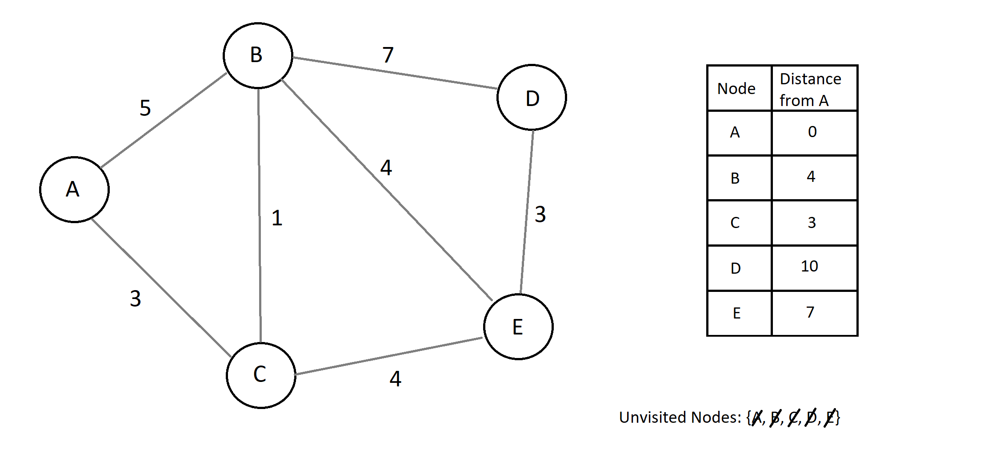

## Dijkstra's Algorithm

As mentioned, Dijkstra's algorithm is a well known algorithm for determining the shortest distance from one node to every other node in a graph.

The steps of Dijkstra's algorithm are as follows:
1. Begin with your starting node. 
   - Let the distance from the starting node, to the starting node be 0.
   - Let the distance from the starting node to every other node be infinity.
2. Visit the unvisited vertex with the smallest known distance from the start vertex.
3. For the current vertex examine its unvisited neighbors.
4. Calculate the distance of each neighbor from the start vertex.
5. If the calculated distance is less than the known distance, update the shortest distance.
6. Mark the current node as visited.
7. Repeat steps 2 + until all nodes are visited.

Let's take a look at an example:

