# Stack and Heap

The JVM divides memory into stack and heap memory. *Stack* memory is used to store variables as our program executes, with values stored in the form of Java primitives or references to heap memory where objects are stored.  Each time a method is executed a new stack frame is created. This stack frame contains the state in its corresponding method, and relates to the stack in the traditional LIFO order. When the method has finished executing, the stack frame is removed from the stack and the memory storing those variables is de-allocated automatically. 

As mentioned, the *heap* memory is where objects are stored. Unlike what's stored on the stack, heap memory is not de-allocated when a method is done executed. Instead, this process is managed by garbage collection. When there are no more references to an object in heap memory, that object becomes eligible for garbage collection. This does not mean that it is de-allocated at this time, only that it can be. We can suggest garbage collection (using System.gc()) but this is merely a suggestion for the JVM and there is no assurance that garbage collection can occur.

Java is always pass by value, meaning when a variable is passed into a method, the method executes on the value of the variable rather than the reference. Let's take a look at what that means by visualizing the stack and the heap:

#### Pass by value with primitives

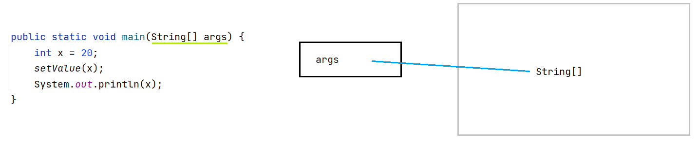

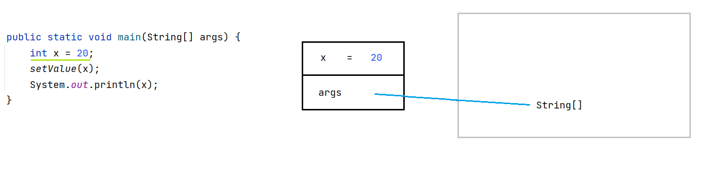)

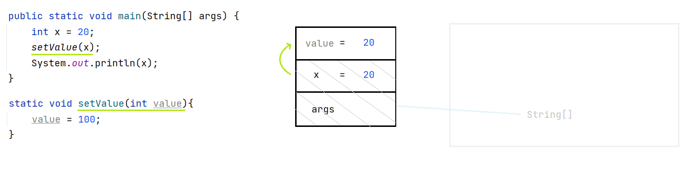)

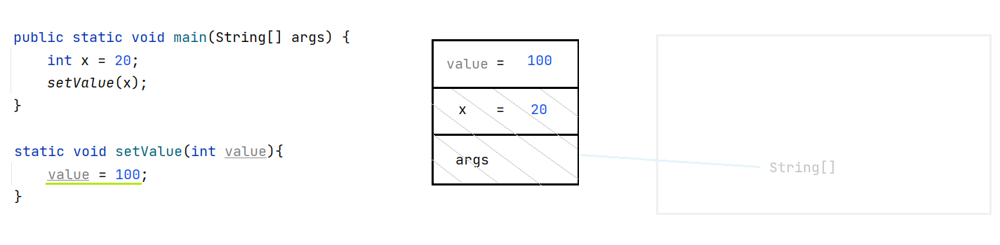)

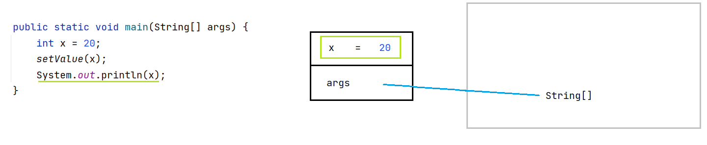)

#### Pass by value with reference types 

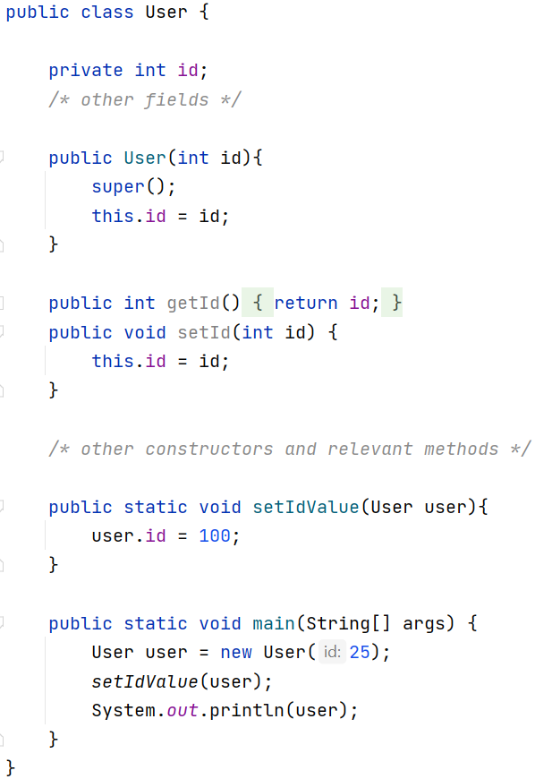

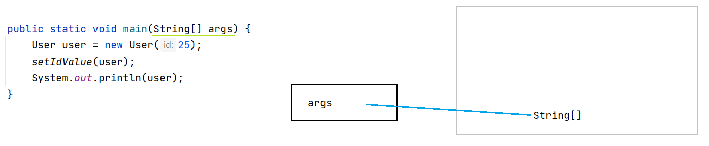

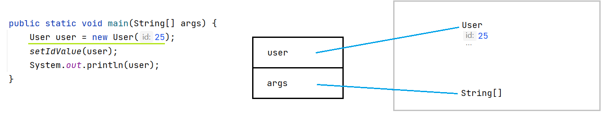

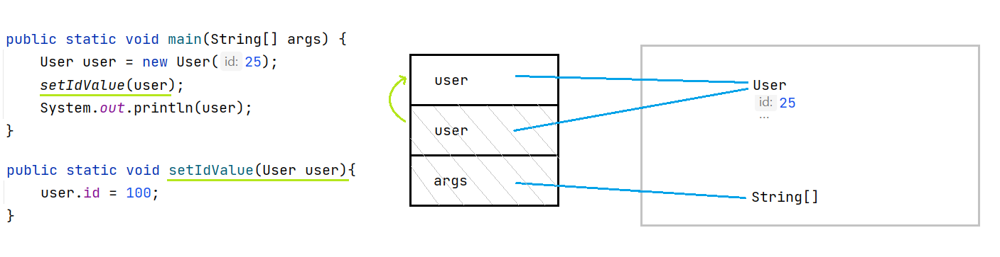

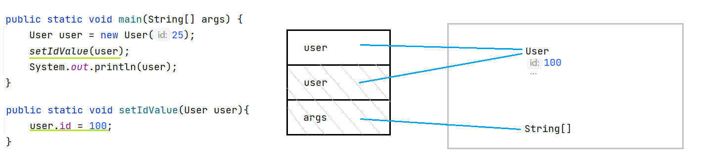

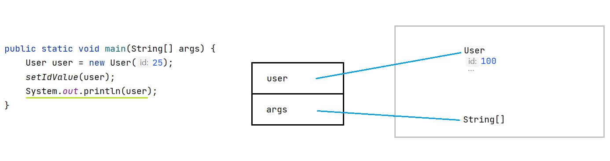
